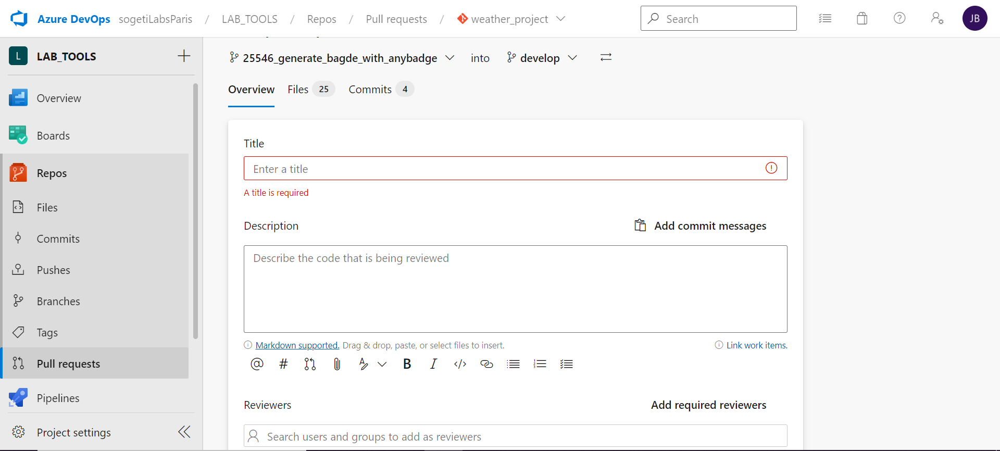

# Git FLow
## Commandes générales Git

### Récupérer un dépôt distant
`git clone <my-url-project>`
```js
Cloning into `<my-url-project>`...
> remote: Counting objects: 10, done.
> remote: Compressing objects: 100% (8/8), done.
> remove: Total 10 (delta 1), reused 10 (delta 1)
> Unpacking objects: 100% (10/10), done.
```  
### Savoir le statut de notre suivi Git
`git status`
>👇 Si vous en 'avance' par rapport à la branch en remote.
```js
On branch main
Your branch is up to date with 'origin/main'.

Changes not staged for commit:
(use "git add <file>..." to update what will be committed)
(use "git restore <file>..." to discard changes in working directory)
        modified:   graph.js
        modified:   public/stylesheets/style.css
        modified:   routes/drive.js
        modified:   views/drive.hbs

no changes added to commit (use "git add" and/or "git commit -a")
```
>👇 Si vous êtes à jour.
```js
On branch develop
Your branch is up to date with 'origin/develop'.

nothing to commit, working tree clean
```  
### Mettre à jour depuis le dépôt distant
`git pull`
>👇 Ici on récupère 3 nouvelles branches et on met à jour 15 fichiers.
```js
Unpacking objects: 100% (15/15), done.
From https://dev.azure.com/sogetiLabsParis/LAB_TOOLS/_git/weather_project
 * [new branch] 24796_generate_index_template_v2 -> origin/24796_generate_index_template_v2
 * [new branch] 25209_update_script_python -> origin/25209_update_script_python
 * [new branch] 25217_fix_type_module_mozilla -> origin/25217_fix_type_module_mozilla  
 Already up to date.
```  

### Envoyer vers le dépôt distant 
Avant d'envoyer son code local 💻 vers le dépôt distant (ex github)
`git pull`
>👇 Ici on récupère 3 nouvelles branches et on met à jour 15 fichiers.
```js
Unpacking objects: 100% (15/15), done.
From https://dev.azure.com/sogetiLabsParis/LAB_TOOLS/_git/weather_project
 * [new branch] 24796_generate_index_template_v2 -> origin/24796_generate_index_template_v2
 * [new branch] 25209_update_script_python -> origin/25209_update_script_python
 * [new branch] 25217_fix_type_module_mozilla -> origin/25217_fix_type_module_mozilla  
 Already up to date.
```  

### Lister toutes les branches
Local  
`git branch`
>👇 A noter que la branch sur laquelle on se trouve est signalée d'un *.
```js
* develop
main
```  
Remote  
`git branch -r`
>👇 **origin** n'est pas le nom du référentiel distant. Il s'agit plutôt d'un alias **local** défini comme clé à la place de l'URL du référentiel distant.
Cela évite à l'utilisateur d'avoir à taper l'intégralité de l'URL distante lorsqu'il demande un push.
```js
origin/24431_menu_section
origin/24438_add_authentification
origin/24697_jquery_not_working_bug
origin/24768_add_auth_page-revert-from-develop
origin/24779_index_template_for_project_groups
origin/24796_generate_index_template
origin/25056_sort_data_json
origin/25081_clean_html
origin/25115_add_filter_searchbar
origin/HEAD -> origin/main
origin/develop
origin/main
```  
 Local + Remote  
`git branch -a`
>👇 A noter que les branchs distantes commencent par **remote**.
 ```js
* develop
 main
remotes/origin/24431_menu_section
remotes/origin/24438_add_authentification
remotes/origin/24697_jquery_not_working_bug
remotes/origin/24768_add_auth_page-revert-from-develop
remotes/origin/24779_index_template_for_project_groups
remotes/origin/24796_generate_index_template
remotes/origin/25056_sort_data_json
remotes/origin/25081_clean_html
remotes/origin/25115_add_filter_searchbar
remotes/origin/HEAD -> origin/main
remotes/origin/develop
remotes/origin/main
```
### Créer une nouvelle branche
`git checkout -b <my-branch-name>`
>👇 A noter que c'est l'option **-b** qui permet de créer une nouvelle branche et que l'on est automatiquement déplacé dessus lors de sa création.
```js
Switched to a new branch '<my-branch-name>'
```  
### Se déplacer dans les branches
Local  
`git checkout <my-branch-name>`
>👇 A noter que checkout s'exécute **sans** option.
```js
Switched to branch '<my-branch-name>'
```  
Remote  
`Git Pull`  
`git checkout --track origin <my-branch-name>`
>👇 A noter que c'est plutôt rare de vouloir récupérer une branche qui n'est pas au même niveau depuis le dépôt distant.
```js
Switched to branch '<my-branch-name>'
```  
### Supprimer une branche
Local  
`git checkout <my-branch-name>`
>👇 A noter que checkout s'exécute avec l'option **-d**.
```js
Deleted branch <my-branch-name> (was f187012).
```  
Remote  
`git push origin --delete <my-branch-name>`
>☝️ UNIQUEMENT dans le cas ou l'on push une branche qu'on ne voulait pas envoyer sur le dépôt distant !


## Bonnes pratiques

### Faire une User Story
`git pull` => MAJ du dépôt  
`git checkout develop`  => On va sur la branche **'develop'**  
`git checkout -b <my-new-branch-name>`  => On créer une nouvelle branche sur laquelle travailler  

### Faire une Pull Request
Après avoir fait votre commit final sur votre `<my-branch-feature>`   
`git pull` => MAJ du dépôt  
`git push origin develop` => Envoi sur le dépôt distant  
Aller sur le dépôt distant Azure et cliquer dans le sous menu Pull Requests    
Choisir un titre (obligatoire)  
Séléctionner la branch à merge dans la branch `develop`  
